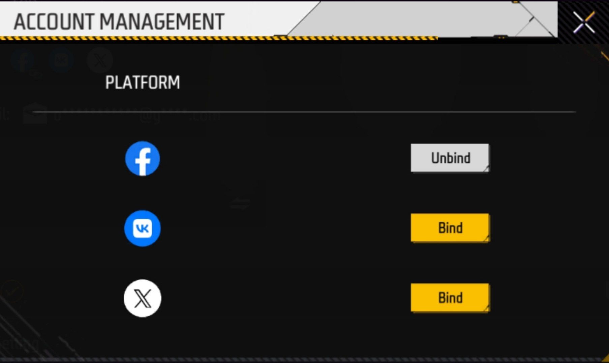

<p align="center">
  
</p>

<h1 align="center">Garena Major Secondary Account Bind</h1>

<p align="center">
  Python tool for constructing and sending an encrypted account-bind request.
</p>

## Features

* Exchanges a Twitter platform token through OAuth endpoint.
* Extracts the returned `open_id`, `access_token`, and `platform`.
* Builds a protobuf-style binary payload using manually implemented VarInt encoding.
* Encrypts the payload using AES-128-CBC.
* Sends the encrypted request to the endpoint.
* Prints the HTTP status code and server response.

## Requirements

* Python 3.9+
* `requests`
* `pycryptodome`

Install dependencies:

```bash
pip install requests pycryptodome
```

Or:

```bash
pip install -r requirements.txt
```

## Disclaimer

This project is provided for educational and research purposes. Use it only with accounts, credentials, and services you are authorized to access. Respect terms of service and applicable laws.
